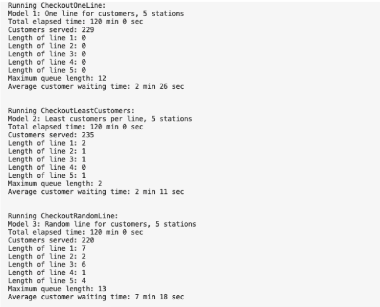

# Checkout Line Model Simulation

## Project Overview
This project demonstrates an implementation and comparison of three distinct models for self-checkout 
stations in a grocery store using the queue data structure. The objective was to assess the efficiency 
and performance of each model under similar conditions. 

The following was programmed for out simulations.

##Parameters:
The Customer class defines several key parameters and calculates the checkout time:
- Each customer has a random number of items to check out, ranging from 10 to 40.
- It takes 5 seconds to scan each item.
- Payment time varies randomly between 20 to 40 seconds and is defined in the getDuration() method of the customer class

The CheckoutStation class tracks when stations are free, busy, and current customer using the station:
- The startCheckout() method monitors the customer at the station, checkout duration, and marks if the station is busy
- update() is used to mark the station as not busy when the customer is done.
- isFree() is used to mark open stations.  

## Project Paper
Here is a link to the project paper:

https://github.com/jameshopham/Checkout-Line-Simulation/blob/main/summary_document_queues.pdf

### Built With

This project was built with the following technologies:

- Java
- java.util.ArrayList
- java.util.NoSuchElementException
- java.util.List
- java.util.Random
- java.util.Comparator

## Contact

If you have any questions or suggestions, feel free to reach out to me:

- Connect with me on LinkedIn:

    
     
    <a href="https://www.linkedin.com/in/james-hopham-2440352a5/" target="_blank">James Hopham</a>
